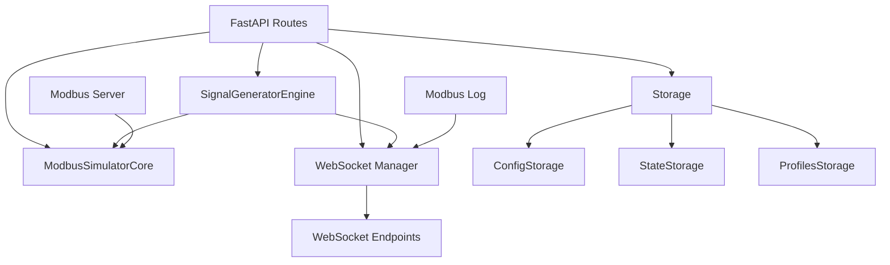

# Архитектура проекта Modbus Simulator

## Обзор

Modbus Simulator — это полнофункциональная веб-платформа для симуляции Modbus TCP/IP устройств. Проект состоит из frontend (React + TypeScript) и backend (Python + FastAPI), предоставляя визуальный интерфейс для управления регистрами, генераторами сигналов и профилями конфигураций.

## Структура проекта

```
modbud_simulator/
├── frontend/               # React приложение
│   ├── src/
│   │   ├── api/           # Модульные API клиенты
│   │   ├── features/      # Функциональные модули
│   │   ├── shared/        # Общие компоненты и утилиты
│   │   └── App.tsx        # Главный компонент
│   └── Dockerfile
├── backend/               # FastAPI сервер
│   ├── app/
│   │   ├── api/          # API роуты
│   │   ├── storage/      # Модули хранилища
│   │   ├── modbus_core.py
│   │   └── main.py
│   └── Dockerfile
└── docker-compose.yml
```

## Backend архитектура

### Ключевые компоненты

#### 1. ModbusSimulatorCore
Ядро симулятора, реализующее Modbus протокол:
- Управление регистрами (coils, discrete_inputs, holding, input)
- Обработка Modbus функций (FC01-FC06, FC15-FC16)
- Синхронизация доступа к данным

#### 2. Storage система
Модульная система хранения, разделённая на классы:

```python
Storage/
├── ConfigStorage      # config.yaml - настройки Modbus
├── StateStorage       # state.json - состояние регистров
└── ProfilesStorage    # profiles/*.yaml - профили
```

**Флоу данных:**
```
Загрузка:  Файл → Storage → Config/Core → API
Сохранение: API → Core → Storage → Файл
```

#### 3. Signal Generators Engine
Генератор динамических сигналов:
- Типы волн: sine, saw, square, constant
- Форматы данных: INT16, FLOAT32, FLOAT64
- Фоновая генерация через threading
- Запись напрямую в holding регистры

#### 4. WebSocket Communication
Real-time обновления через WebSocket (заменил HTTP polling):
- **ConnectionManager** - управление WebSocket соединениями
- **Раздельные каналы:** registers, server, generators
- **Auto-reconnection** с exponential backoff
- **Broadcast** событий из threading кода через `asyncio.run_coroutine_threadsafe()`

**WebSocket Endpoints:**
- `/ws/registers` - изменения регистров
- `/ws/server` - статус сервера, Modbus лог
- `/ws/generators` - значения генераторов (~120ms)

См. [docs/WEBSOCKET.md](docs/WEBSOCKET.md) для детальной информации.

#### 5. REST API роуты

| Группа | Путь | Назначение |
|--------|------|-----------|
| Config | `/api/config` | Управление конфигурацией Modbus |
| State | `/api/state/{kind}` | Чтение/запись регистров |
| Generators | `/api/generators` | CRUD генераторов сигналов |
| Profiles | `/api/profiles` | Управление профилями |
| Server | `/api/server/*` | Контроль Modbus сервера |
| WebSocket | `/ws/{channel}` | Real-time обновления |

### Зависимости модулей



## Frontend архитектура

### Feature-based структура

```
features/
├── auth/          # Авторизация
├── config/        # Конфигурация Modbus
├── generators/    # Генераторы сигналов
├── logs/          # Журнал событий
├── profiles/      # Профили
├── registers/     # Регистры и форматы
├── server/        # Управление сервером
└── websocket/     # WebSocket Context и hooks
```

### React Context API

Каждая фича имеет Context для глобального state:

```typescript
RegistersContext      → Управление регистрами и форматами
GeneratorsContext     → Конфигурация генераторов
ServerContext         → Статус сервера и polling
LogsContext           → Централизованное логирование
ProfilesContext       → Профили конфигураций
```

### Модульная API структура

```
api/
├── client.ts       # Axios instance + auth interceptor
├── types.ts        # Общие типы API
├── registers.ts    # Операции с регистрами
├── generators.ts   # Управление генераторами
├── profiles.ts     # CRUD профилей
├── server.ts       # Статус и управление сервером
└── index.ts        # Re-exports
```

### Shared компоненты

```
shared/
├── components/     # UI primitives (Button, Input, RadioGroup)
├── hooks/          # Custom hooks (useWebSocket, useApiCall)
├── types/          # TypeScript типы
└── constants.ts    # Константы приложения
```

### Data Flow

```
User Action → Context → API Call/WebSocket → Backend
                ↓
            Local State Update
                ↓
            Re-render Component
```

## Интеграция Frontend ↔ Backend

### REST API паттерн
- Синхронные операции через axios
- Централизованный error handling
- Базовая авторизация через interceptors

### WebSocket real-time
```typescript
useWebSocket(channel, handler)
  ↓
  Push-события → Update Context → Re-render
```

Используется для:
- Мгновенных обновлений регистров (`/ws/registers`, события `registers_changed`)
- Статуса сервера (`/ws/server`)
- Значений генераторов (`/ws/generators`, события `generator_values`)

## Persistence модель

### Файлы данных

```
data/
├── config.yaml          # Конфигурация Modbus
├── state.json           # Текущие значения регистров
└── profiles/
    ├── default.yaml     # Профиль по умолчанию
    └── *.yaml           # Пользовательские профили
```

### Профиль структура

```yaml
name: "Production Setup"
comment: "Рабочая конфигурация"
config:
  host: "0.0.0.0"
  port: 502
  # ... размеры областей
state:
  coils: [0, 1, 0, ...]
  holding_registers: [100, 200, ...]
generators:
  - id: "gen-1"
    name: "Temperature"
    wave_type: "sine"
    # ... параметры
```

## Security

### Базовая авторизация
- HTTP Basic Auth (опционально)
- Конфигурация через переменные окружения
- Перехватчик 401 → redirect на login

### CORS
- Разрешены все origins в dev режиме
- Настраивается через FastAPI middleware

## Development паттерны

### Frontend

1. **Component композиция**: Мелкие, переиспользуемые компоненты
2. **Custom hooks**: Инкапсуляция логики (usePolling, useApiCall)
3. **Type safety**: Строгая типизация через TypeScript
4. **Barrel exports**: index.ts для удобного импорта

### Backend

1. **Dependency injection**: Передача зависимостей через init функции
2. **Exception handling**: Централизованная обработка через HTTPException
3. **Logging**: Структурированное логирование через Python logging
4. **Type hints**: PEP 484 аннотации для всех функций

## Performance соображения

### Frontend
- React.memo для оптимизации re-renders
- useMemo/useCallback для дорогих вычислений
- Lazy loading для больших компонентов (будущее)

### Backend
- Threading для генераторов (не блокирует API)
- Быстрая запись в регистры через прямой доступ к массивам
- Минимальная сериализация в storage операциях

## Масштабирование

### Горизонтальное
- Stateless API (state в core, не в памяти API)
- Shared storage (файлы или БД)

### Вертикальное
- Увеличение размеров регистров
- Больше генераторов сигналов
- WebSocket для снижения overhead

## Testing strategy

### Frontend (будущее)
- Unit тесты для converters и formatters
- Component тесты для shared UI
- Integration тесты для contexts

### Backend
- Unit тесты для ModbusCore
- Integration тесты для Storage
- API endpoint тесты

## Deployment

### Docker
```bash
docker-compose up -d
```

Сервисы:
- `frontend`: Nginx + React build (порт 3000)
- `backend`: FastAPI + Uvicorn (порт 8000)

### Volumes
```yaml
volumes:
  - ./data:/app/data  # Persistent storage
```

## Future improvements

1. **WebSocket** для real-time updates
2. **Database** (PostgreSQL/SQLite) вместо файлов
3. **Authentication** JWT вместо Basic Auth
4. **Monitoring** Prometheus/Grafana
5. **Multi-tenancy** Support нескольких симуляторов
