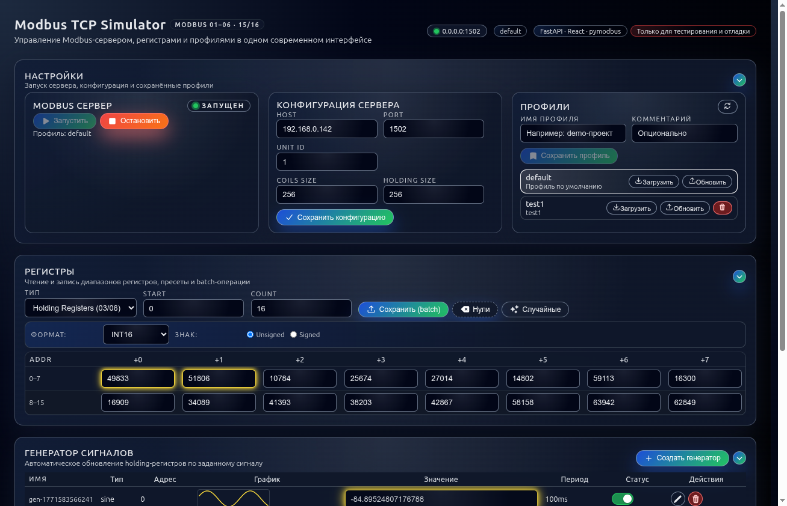
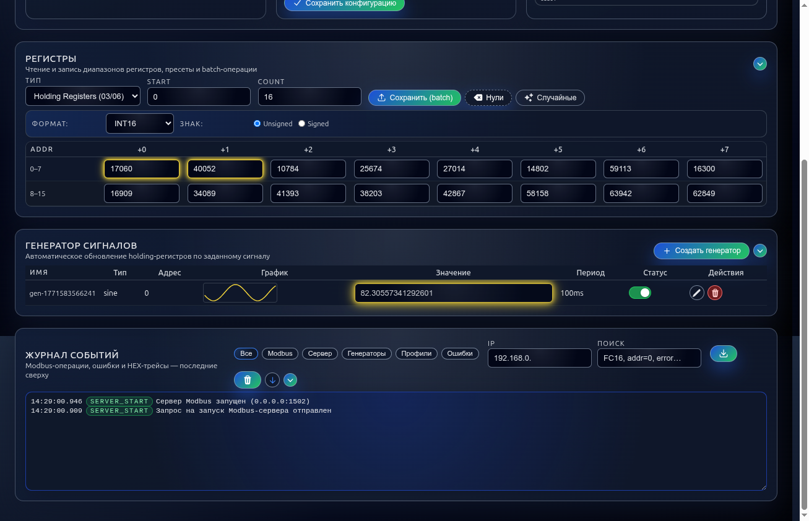
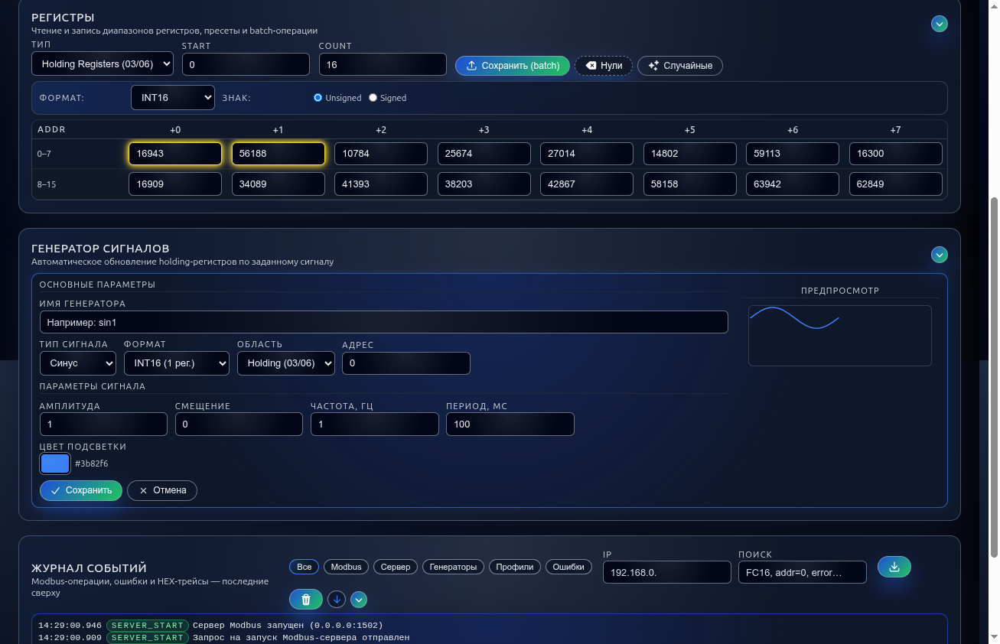
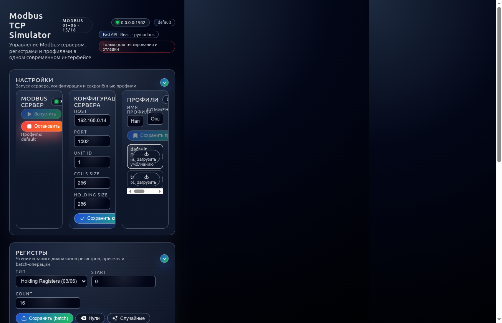

# Modbus TCP Simulator

Симулятор Modbus TCP slave с современным WEB-интерфейсом для конфигурирования, наблюдения за регистрами и генерации тестовых сигналов.



## Содержание

- [Возможности](#возможности)
- [Скриншоты](#скриншоты)
- [Быстрый старт](#быстрый-старт)
- [Документация](#документация)
- [Разработка](#разработка)
- [Тестирование](#тестирование)
- [Авторизация](#авторизация-опционально)

## Возможности

### Modbus TCP Slave (Backend)
- Функции **01–06, 15/16** (coils, discrete inputs, holding registers, input registers)
- Запуск/остановка сервера через API и GUI
- Хранение конфигурации и состояния в YAML/JSON файлах
- Модульная архитектура storage (config, state, profiles)
- **WebSocket real-time:** мгновенные обновления регистров, статуса сервера и генераторов

### WEB GUI (React + TypeScript)
- Конфигурация Modbus параметров (host, port, unit ID, размер регистров)
- Просмотр и редактирование регистров в реальном времени
- Форматы отображения: **INT16/32/64, FLOAT32/64, BITMAP**
- Пакетная запись, пресеты (нули, случайные значения)
- Управление профилями конфигураций
- Журнал событий Modbus с фильтрами, поиском и цветными badge-ами
- Toast-уведомления при всех операциях
- Горячие клавиши (`?` — справка, `Ctrl+S` — сохранить, `Escape` — закрыть)
- Адаптивный responsive layout

### Генератор сигналов
- Фоновое обновление holding/input-регистров по заданному сигналу
- Типы сигналов: **синус, пила, меандр, константа**
- Форматы: INT16, FLOAT32, FLOAT64
- Настраиваемые параметры: амплитуда, частота, смещение, период обновления
- Параллельная работа нескольких генераторов
- Живой предпросмотр сигнала в форме создания
- Неоновая подсветка генерируемых регистров (настраиваемый цвет)

### Профили
- Сохранение полной конфигурации (config + state + генераторы) под именем
- Комментарии к профилям
- Загрузка, обновление и удаление профилей с подтверждением
- Хранение в YAML файлах
- Профиль `default` создаётся автоматически и защищён от удаления

## Скриншоты

### Основной интерфейс
Панели настроек, регистров, генераторов и журнала событий. Статус сервера и текущий профиль отображаются в шапке.


### Регистры, генератор и журнал
Таблица регистров с данными, генератор сигналов с живым графиком и журнал событий Modbus.



### Форма создания генератора
Двухколоночный layout с параметрами сигнала слева и предпросмотром графика справа.



### Адаптивный layout
На узких экранах панели выстраиваются вертикально: Настройки → Регистры → Генераторы → Журнал.



## Быстрый старт

### Docker Compose (рекомендуется)

```bash
docker compose up --build
```

**Доступ:**

| Сервис | URL |
|--------|-----|
| WEB GUI | `http://localhost:8080` |
| Backend API | `http://localhost:8000/api` |
| API Docs (Swagger) | `http://localhost:8000/docs` |
| Modbus TCP | `localhost:1502` |

### Локальная разработка

**Backend:**
```bash
cd backend
pip install -e .[dev]
uvicorn app.main:app --reload --host 0.0.0.0 --port 8000
```

**Frontend:**
```bash
cd frontend
npm install
npm run dev
```

Frontend: `http://localhost:5173`, API прокси `/api` → `http://localhost:8000`

## Документация

| Документ | Описание |
|----------|----------|
| [ARCHITECTURE.md](./ARCHITECTURE.md) | Архитектура проекта, структура модулей, data flow |
| [CONTRIBUTING.md](./CONTRIBUTING.md) | Руководство для разработчиков, code style, git workflow |
| [docs/API.md](./docs/API.md) | Полная REST + WebSocket API документация |
| [TESTING.md](./TESTING.md) | Руководство по тестированию (backend + frontend) |
| [DOCKER_REBUILD.md](./DOCKER_REBUILD.md) | Инструкции по пересборке Docker после изменений |

### Структура проекта

```
modbud_simulator/
├── frontend/                  # React 18 + TypeScript + Vite
│   ├── src/
│   │   ├── api/              # Модульные API клиенты (axios)
│   │   ├── features/         # Feature-based модули
│   │   │   ├── auth/         # Авторизация
│   │   │   ├── config/       # Конфигурация сервера
│   │   │   ├── server/       # Управление Modbus сервером
│   │   │   ├── profiles/     # Профили конфигураций
│   │   │   ├── registers/    # Регистры (таблица, конвертеры)
│   │   │   ├── generators/   # Генераторы сигналов
│   │   │   ├── logs/         # Журнал событий
│   │   │   └── websocket/    # WebSocket коммуникация
│   │   ├── shared/           # Переиспользуемые компоненты и хуки
│   │   └── App.tsx           # Композиция (~165 строк)
│   └── Dockerfile
├── backend/                   # FastAPI + Python 3.10+
│   ├── app/
│   │   ├── api/              # REST API endpoints
│   │   ├── storage/          # Модульное хранилище (config/state/profiles)
│   │   ├── modbus_core.py    # Доменное ядро Modbus
│   │   ├── modbus_server.py  # Адаптер pymodbus
│   │   ├── signal_generators.py  # Движок генераторов
│   │   └── main.py           # FastAPI app + lifespan
│   └── Dockerfile
├── docs/                      # Документация
│   ├── API.md
│   └── screenshots/          # Скриншоты GUI
├── memory-bank/               # Memory Bank (проектная документация)
├── ARCHITECTURE.md
├── CONTRIBUTING.md
└── docker-compose.yml
```

## Разработка

### Технологии

**Frontend:**
- React 18 + TypeScript (strict mode)
- Vite — сборка и dev-server
- Axios — HTTP клиент
- WebSocket API — real-time обновления
- React Context API — state management
- @heroicons/react — SVG иконки
- Sonner — toast уведомления

**Backend:**
- FastAPI + Uvicorn
- Pymodbus 3.6.x — Modbus TCP
- Pydantic v2 — валидация и схемы
- YAML/JSON — файловое хранилище
- Threading — фоновые генераторы сигналов

### Архитектура

**Frontend** — feature-based модульная архитектура:
- Каждая feature = Context (state + logic) + UI компоненты
- Shared UI: Button, Input, ToggleSwitch, ConfirmDialog, Skeleton, ShortcutsHelp
- Custom hooks: useWebSocket, useCollapse, useApiCall, useKeyboardShortcuts
- Модульная API: client.ts + доменные модули (registers, generators, profiles, server)

**Backend** — модульная архитектура:
- `ModbusSimulatorCore` — чистое доменное ядро
- `modbus_server` — адаптер pymodbus
- `storage/` — модульное хранилище (SRP: config, state, profiles)
- `signal_generators` — движок генераторов в фоновом потоке

### Code Style

**Frontend:** TypeScript strict, React.FC, PascalCase (компоненты), camelCase (функции)

**Backend:** PEP 8, type hints, Google-style docstrings, ruff (линтинг)

См. [CONTRIBUTING.md](./CONTRIBUTING.md) для деталей.

## Тестирование

**Всего: 157 тестов (backend 102, frontend 55) — все проходят.**

### Backend

```bash
cd backend
pip install -e .[dev]
pytest tests/ -v
pytest --cov=app
```

Покрытие: health, state API, server API, profiles API, generators API, encoding_utils, modbus_core (41 тест), modbus_integration (18 тестов).

### Frontend

```bash
cd frontend
npm install
npm test
npm run test:coverage
```

Покрытие: converters (все форматы), useCollapse, WebSocketContext.

### Docker

```bash
docker compose run --rm backend python -m pytest tests/ -v
docker compose --profile testing run --rm frontend-test
```

См. [TESTING.md](./TESTING.md) для подробностей.

## Авторизация (опционально)

Защита доступа через HTTP Basic Auth:

```yaml
# docker-compose.yml
environment:
  - MB_AUTH_USER=admin
  - MB_AUTH_PASS=secret
```

Без этих переменных авторизация не требуется.

## Production

**Рекомендации:**

1. Настройте CORS whitelist в `backend/app/main.py`
2. Используйте переменные окружения для конфигурации
3. Настройте volume для `/app/data` для persistence
4. Добавьте nginx reverse proxy с rate limiting
5. Включите HTTPS

См. [ARCHITECTURE.md](./ARCHITECTURE.md) для деталей.

## Лицензия

MIT

## Contributing

Contributions welcome! См. [CONTRIBUTING.md](./CONTRIBUTING.md) для начала работы.
